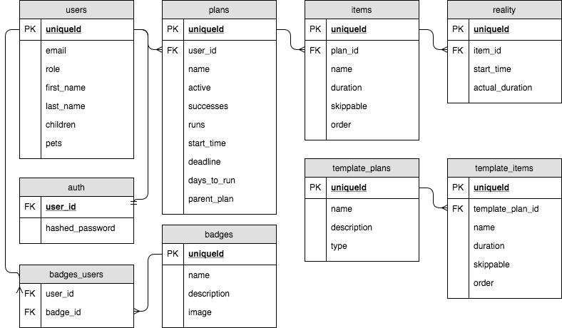

# DashDash (Server)
> User can create a nested set of timers to keep them on track during a task, such as getting ready to go to work. So, rather than a simple wake-up timer, this app will invoke a series of timered steps to keep the user on track: wake up, finish showering, finish breakfast, out the door, etc.
> This is the backend server.

The DashDash server uses JavaScript with Express and a PostgreSQL database (via Knex.JS) to store and process data requests. Auth uses bcryptjs and jsonwebtoken.

* Stores and serves users, templates, and timer plans.
* Uses auth tokens to protect routes. Tokens are only used to verify the requesting user ID; the database is queried for all other user details.
* Errors are selectively filtered between the server and client to provide helpful responses, while also protecting backend layout from being exposed to the client.

## Database Structure

## Installation
1. npm install
### Development
2. createdb dashdash_dev
3. npm run knex migrate:latest
4. npm run knex seed:run
5. npm run dev

## Next Steps
- [ ] Split sensitive user data (ie. hashed_passwords) into it's own table to further protect data.
